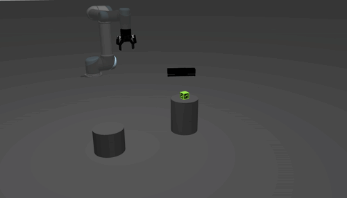
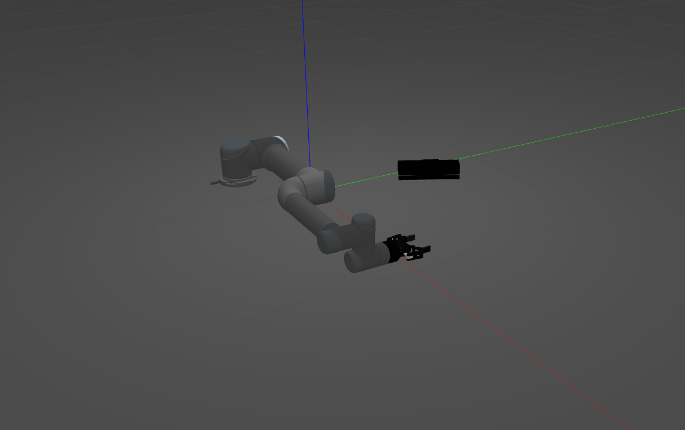
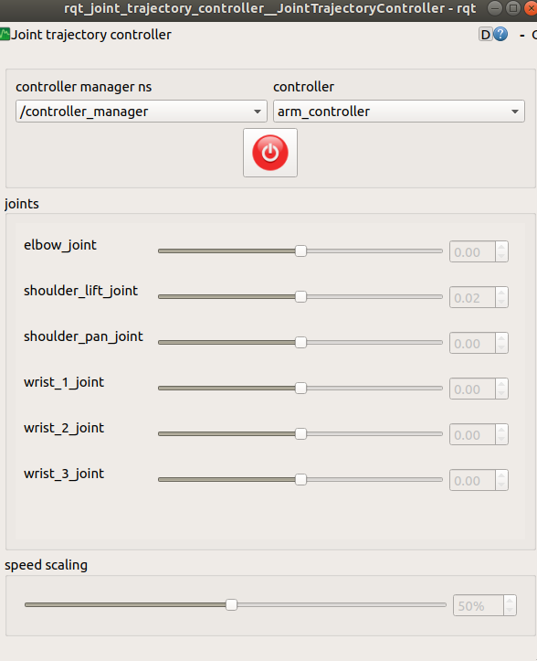
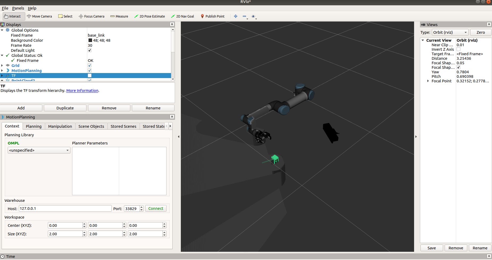
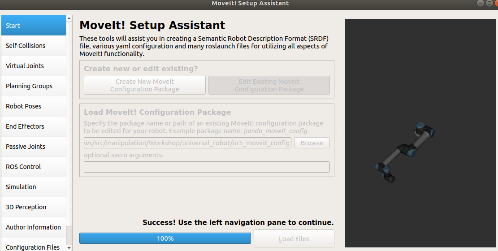
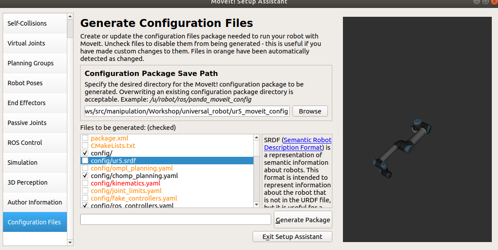

# Manipulation



**Goal:**

The session aims to familiaries you with one of the most crucial aspects of modern robotics, *manipulation*.

**What do we mean by manipulation?**

Whenever a robots physically interacts with its surrounding and modifies its environement, we talk about manipulation.

**What are the challenges of robotic manipulation?**
+ *Path Planning:* Generally, a robotic arm is used for manipulation ([ABB IRB 120](https://new.abb.com/products/robotics/industrial-robots/irb-120), [UR5](https://www.scottautomation.com/products/ur5-universal-robot/)). An arm often has between 5 and 7 Dof. Powerful planning algorithms must be used ([RRTs](https://en.wikipedia.org/wiki/Rapidly-exploring_random_tree) for example) to find a path in joint or end-effector space.
+ *Grasping:* Once the arm knows how to travel from one place to another, its time to actually grasping something. Grasping in a vast and vibrant research topic mostly because how challenigng it can be for robots to find suitable grasp poses for everyday objects.


**What tools do we have to solve this problem?**

+ *ROS:* ROS allows us to integrate all aspects needed for manipulation.
+ *[Moveit](https://moveit.ros.org/):* Moveit is a ROS package for motion planning build on top of libraries such as [OMPL](http://ompl.kavrakilab.org/).

**What else do we need to know?**
+ Manipulation works only if the robot knows what it looks like so we will be using URDFs
+ The [MoveGroup](http://docs.ros.org/jade/api/moveit_ros_planning_interface/html/classmoveit_1_1planning__interface_1_1MoveGroup.html) class will be useful.

## Let's begin

### Workspace
By now you should have already set up a catkin workspace. Clone this repo in `workshop_ws/src`.

<details><summary>Click for Hint</summary>
  
<p>

```python
cd ~/workshop_ws/src
git clone https://github.com/ros-workshop/manipulation.git
```
</p>

</details>

### Dependencies

First install [catkin tools](https://robotics.stackexchange.com/questions/16604/ros-catkin-make-vs-catkin-build) `sudo apt-get install python-catkin-tools` which allows to build the workspace in a more modular fashion.

Second, installed the depenencies stipulated by the `package.xml`
`rosdep install --from-paths src --ignore-src -r -y`

if you do not have `rosdep`, install it. 


There are quite a few packages that need to be installed for the session:

+ moveit_ros
+ moveit_core
+ apriltag_ros
+ image_geometry
+ husky_description
+ controller_manager
+ gazebo_ros_control
+ abb_resources # for next session
+ ros_control

<details><summary>Click for Hint</summary>
  
You can `sudo apt install` almost all of these packages.

<br/>

<details><summary>Click to cheat!</summary>
  
```
sudo apt install ros-melodic-moveit-ros ros-melodic-moveit-core\
                 ros-melodic-image-geometry ros-melodic-husky-description\
                 ros-melodic-controller-manager ros-melodic-gazebo-ros-control\
                 ros-melodic-abb-resources ros-melodic-apriltag-ros \
                 ros-melodic-gazebo-plugins ros-melodic-ros-control\
                 ros-melodic-moveit ros-melodic-ros-controllers\
                 ros-melodic-apriltag
                 
```

</details>
</details>

## Everything a Robot needs

**ACTION**
Launch the robot in gazebo. 
  
<details><summary>Click for Hint</summary>
  
<p>
  
We are afther a UR5 (Universal robot) robotic arm. All you need is in the `Worshop` directory 

</p> 

</details>
<br>

You should see something like this:



The arm, gripper and camera should stand up straight and be static.

### Controllers

Each joint or motor in the arm and hand needs a controller for actuation. Ask yourself this: What controllers do I expect for a robotic arm with an end-effector? Make sure the controllers have loaded appropriately. 

**ACTION**
Check which controllers are loaded.

<details><summary>Click for Hint</summary>
  
<p>
There should be a least 3 controllers.
  
+ Arm Controller
+ Gripper Controller
+ Joint State Controller

There is a useful rqt plugin to check your controllers 


</p> 

<details><summary>Click to cheat!</summary>

Install and run [rqt_controller_manager](http://wiki.ros.org/rqt_controller_manager)

```
sudo apt install ros-melodic-rqt-controller-manager  
source /opt/ros/melodic/setup.bash 
rosrun rqt_controller_manager rqt_controller_manager 
```
if you get an exception when running it, try to fix it with a `try/except` combination in the original rqt package.

</details>
</details>
<br>

----------------------------------------------------------

Now to see the controllers in action, jog the arm and fingers manually.

**ACTION**
Move the arm and fingers.

<details><summary>Click for Hint</summary>
  
<p>

There is an rqt plugin for that!



<details><summary>Click to cheat!</summary>

Install and run [rqt_joint_trajectory_controller](http://wiki.ros.org/rqt_joint_trajectory_controller)

```
sudo apt install ros-melodic-rqt-joint-trajectory*
source /opt/ros/melodic/setup.bash 
rosrun rqt_joint_trajectory_controller rqt_joint_trajectory_controller
```

</details>

</details>

### Joint States

**ACTION** Check that you are getting feedback from your robots `joint_states`.

<details><summary>Click for Hint</summary>

Use `rostopic echo /joint_states` and you should see something like:

```
header: 
  seq: 206558
  stamp: 
    secs: 3364
    nsecs: 470000000
  frame_id: ''
name: [abb2_joint_1, abb2_joint_2, abb2_joint_3, abb2_joint_4, abb2_joint_5, abb2_joint_6,
  finger_1_dist_joint, finger_1_med_joint, finger_1_prox_joint, finger_2_dist_joint,
  finger_2_med_joint, finger_2_prox_joint, finger_3_dist_joint, finger_3_med_joint,
  front_left_wheel, front_right_wheel, rear_left_wheel, rear_right_wheel]
position: [0.00032209507270231086, 0.029705080560157526, -0.045566170951020446, 0.0013755875530101491, 0.011665304611981675, 0.0042873037305675155, 0.6000000000889099, 9.921607535545718e-09, -1.3813679089480502e-09, 0.6000000000623906, 9.533138722872536e-09, 4.088242899769057e-08, 0.5999999999707182, 8.249177341212999e-08, -3.791679371458411, -3.7625546328459993, -3.82143007050297, -3.825014721779551]
velocity: [0.0031072944551323338, -0.00024589280552260895, -0.0003502345108150297, -0.01642694515454311, 0.0002473546599235343, 0.015647407170457883, 8.890796740994584e-09, 1.4727589797510176e-08, -5.6046476257774576e-08, 6.238657163250017e-09, 1.0317774130493553e-08, -1.666632588062669e-07, -2.9254809393228006e-09, -1.212269241301142e-07, 9.066189840782844e-05, 0.00020114626581779229, 8.929489784498638e-05, 0.0001963030063448588]
effort: [0.0, 0.0, 0.0, 0.0, 0.0, 0.0, 0.0, 0.0, 0.0, 0.0, 0.0, 0.0, 0.0, 0.0, 0.0, 0.0, 0.0, 0.0]
```

</details>

### Kinect

**ACTION** Check that you are getting images and point clouds from the simulated Kinect sensor

<details><summary>Click for Hint</summary>

View this image topic: `/kinect2/rgb/image_raw`

View this Pointcloud topic: `/kinect2/depth_registered/points` (e.g. using `rviz`)

</details>

## MoveIt

Bringing up the robot in gazebo and start moveit.

**ACTION**
Launch the robot in gazebo and launch the `moveit-planning-execution-gazebo` pkg.

<details><summary>Click for Hint</summary>
  
<p>
  
```
workshop_ws
│   devel
│   build   
└───src
│   │   pkg1
│   │   pkg2
│   └───robot_pkg
│       │   robot_description
|       └───robot_moveit_config
|           |   moveit_planning_execution_gazebo.launch
|           |   demo.launch
```

</p> 

<details><summary>Click to cheat</summary>

```
 roslaunch ur5_moveit_config ur5_moveit_planning_execution.launch                                                    
```

</details>
</details>
<br>

Then launch Rviz and load the `MotionPlanning` pluggin.



In the *planning* tab of the motion planning pluggin, you can click *update* to give the arm a random valid goal and click *plan and execute*. You should see the robot planning the path and move.... 

<details><summary>Click for  Important Hint</summary>
  
<p>
  
IT'S NOT GOING TO MOVE
  
Have a look at the terminal where you've launched moveit from. You should see an error.... that's right, two links are in collision, in fact, all links are in collision! Something is wrong in our moveit configuration  

</p> 

</details>

### Moveit setup assisstant

**ACTION**
Install moveit-setup-assistant

Utimatly, the setup assistant will help us create a package containing all the moveit configuration files along with launch files to get the robot up and running. 

**ACTION**
Launch the moveit-setup assistant and load the broken moveit configuration file.

<details><summary>Click for Hint</summary>
  
<p>
  
`roslaunch moveit_setup_assistant setup_assistant.launch`

</p> 

</details>
<br>

Once loaded you should see a model of your robot appear on the right:



Now take a look at the *Self-Collision* tab (our issue had to do with link collisions). You will notice that there are no collisions defined. Go ahead a generate a collision matrix. 

**NOTE: The gripper is not visible in the robot model**

**ACTION**
Generate a collision matrix.

Two other important tabs in the setup assistant are *Planning Groups* and *End Effectors*. The first one is where we define the joints and links the hand and arm will use for planning. The name are the group are important to know. 

**ACTION**
Inspect how the arm group is formed in the setup assistant.

The *End Effectors* tab is where we define the end-effector of our robot. It won't be used this time.

If you want to understand the Moveit setup assistant better, go through this [tutorial](https://ros-planning.github.io/moveit_tutorials/doc/setup_assistant/setup_assistant_tutorial.html) in your own time.

You can now go to the bottom most tab *Configuration Files*. This is where we generate the moveit pkg and all relevant files. By generating the collision matrix, you would have modified the *.srdf*  file. Before generating the package make sure you select the *.srdf* so that it gets regenerated. All the other boxes can be left as they are.



**ACTION**
Select `config/ur5.srdf` and click Generate Package.

You can now leave the setup assistant and retry launching `roslaunch ur5_moveit_config ur5_moveit_planning_execution.launch`.

You should now be able to plan a path and see the robot move in Gazebo.
Spend some time to use the `Motion planning` rviz pluggin
## Using Moveit

**A quick example a giving a goal to Moveit in a .cpp file**

```rosrun manipulation moveit_expl```

**ACTION**
Inpect this file, see what it does and how. You will need this knowledge later.


Obviously we want to use our newly acquired super-tool to do more than move an arm around using Rviz. It is time to create a application for our arm. A common one is to grasp an object which position is determined using sensors. Here we will be using an image and apriltags.


**ACTION**
Spawn an apriltag in gazebo and start the detectection.

<details><summary>Click for Hint</summary>
  
<p>
  

`roslaunch apriltags_gazebo apriltag_spawn.launch`
`roslaunch apriltags_gazebo continuous_detection.launch`

  

</p> 

</details>
<br>

Now view this detection image on the topic `/tag_detections_image/compressed`


<details><summary>Click for Hint</summary>
  
<p>
  

`rosrun rqt_image_view rqt_image_view "/tag_detections_image/compressed"`

  

</p> 

</details>
<br>


**Applicaiton = Integration**

To create any application in ROS we need to integrate several modules together. From the [perception](https://github.com/ros-workshop/perception) workshop, we now have the pose of our apriltag.

 + Module 1 : Apriltag detection 
    - output: tf from `camera_link` to `tag_link`
    
What we want is to grasp the object with the tag
 
 + Module 3 : Object grasping
    - output: arm and hand trajectory msgs
    - input: pose of the object (`geometry_msgs/Pose`)
 
 We are not quite there! the output of module 1 does not match the input of module 3. We need module 2.
 
 ### Transform listener
 
 Have a look at the node `transform_tag_location.cpp` located in `manipulation`.
 
 Run this node and see what it does. Modify it so we obtain a `geometry_msgs/Pose` out of it.
 
 **ACTION**
Run `transform_tag_location`node and modify it to get a `geometry_msgs/Pose`.
 
 <details><summary>Click for Hint</summary>

<p>

Don't worry about the orientation.

The transform should be from the `planning frame` to the tag frame . You can find out the planning frame when running `moveit_expl`

</p> 

</details>
<br>

You should now have the module 2:

 + Module 2 : msg transform
    - output: pose of the object (`geometry_msgs/Pose`)
    - input: tf from `planning frame` to `tag_link`


### The Manipulation Pipeline

We now have all 3 modules required. Make sure that you have module 1 and 2 running. 

<details><summary>Quick Recap</summary>
  
<p>

To have everything up at running you need to have launched the following:

```
roslaunch ur_gazebo ur5_joint_limited.launch
roslaunch husky_abb_moveit_config  
roslaunch ur5_moveit_config ur5_moveit_planning_execution.launch 
rroslaunch apriltags_gazebo apriltag_spawn.launch 
roslaunch apriltags_gazebo continuous_detection.launch  
rosrun manipulation transform_tag_location 
```

</p> 

</details>
<br>

**Note: It is about time to create a launch file**

Now run `object_grasp_server`. You should see the arm move to a home position. In the terminal, you should see `"tag detected"` if all the required nodes are running. 

As it name indicate, `object_grasp_server` is a serval waiting for a request. Find out what the name of the service is.

<details><summary>Hint</summary>
  
<p>

Use `rosnode info`

</p> 

</details>
<br>

**ACTION**
Call the service from a terminal and observe the robots behaviour. 


**ACTION**
Modify `object_grasp_server.cpp` to make hand grasp the object and that arm drop it on the second stand.

<details><summary>Hint</summary>
  
<p>

Refer to the previous example `moveit_expl.cpp`

/*################Place your code here ##############*/
Indicates where to add code

Some line only need to be commented out

</p> 

</details>
<br>

**Note: We are tricking gazebo to attach the object to the gripper**

**Note: The gripper model is very sensitiv and might break down if it hit the environment. In this case, restart the simulation**

## Strech Goals 

**Goal:** make the arm grasp the object while avoiding the environment

Restart the Gazebo simulation , move the arm to home positionm and launch `obsatcle_apriltag_spawn`. Grasp the object without hittting obstacles.


<details><summary>Hint</summary>
  
<p>

Moveit will do the obstacle avoidance for you provided an OctoMap

An OctoMap can be created using a depth camera

Consult the [moveit tutorial](http://docs.ros.org/melodic/api/moveit_tutorials/html/doc/perception_pipeline/perception_pipeline_tutorial.html) 

</p> 

</details>
<br>
